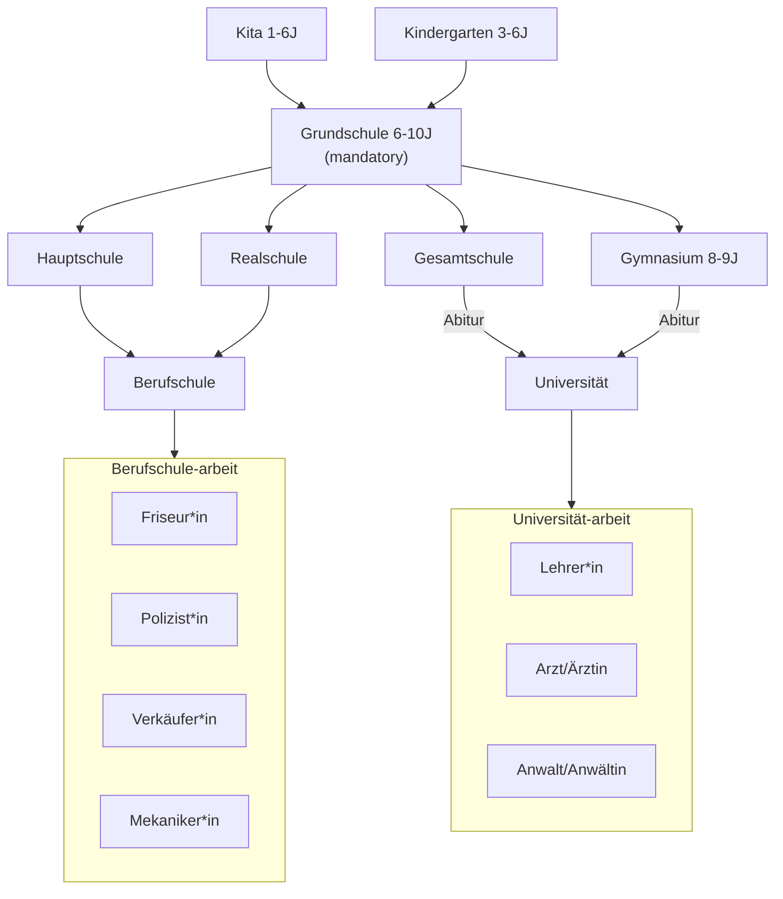

# German school system

```mermaid
flowchart TB
    Kita["Kita 1-6J"] & Kindergarten["Kindergarten 3-6J"] --> Grundschule["Grundschule 6-10J\n(mandatory)"]
    Grundschule --> Hauptschule & Realschule & Gesamtschule & Gymnasium["Gymnasium 8-9J"]
    Hauptschule & Realschule --> Berufschule
    Gesamtschule & Gymnasium -->|Abitur| Universität

    Berufschule --> Berufschule-arbeit
    subgraph Berufschule-arbeit
        Friseur*in
        Polizist*in
        Verkäufer*in
        Mekaniker*in
    end

    Universität --> Universität-arbeit
    subgraph Universität-arbeit
        Lehrer*in
        Arzt/Ärztin
        Anwalt/Anwältin
    end
```
