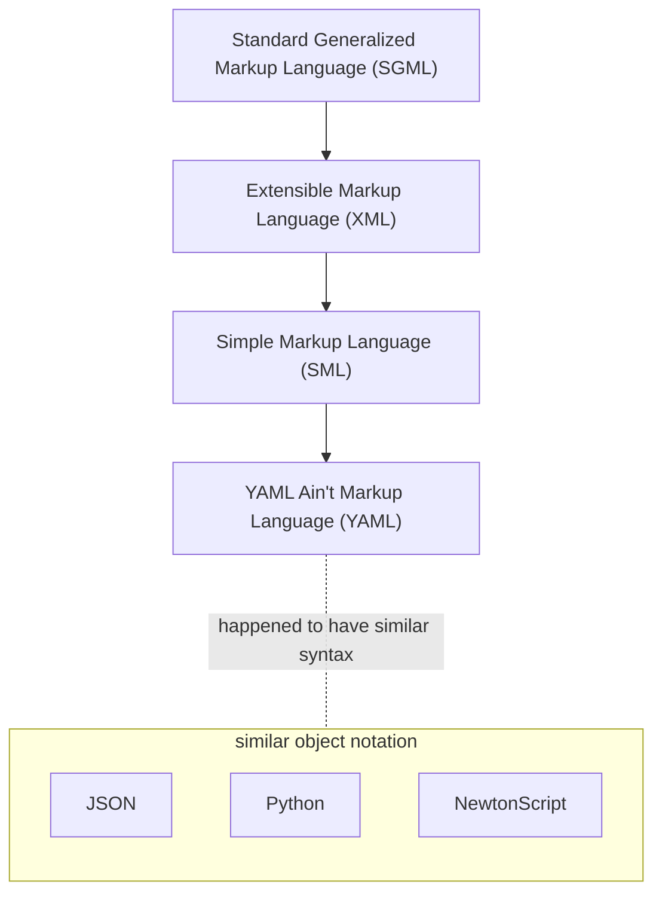

# YAML

```yaml
YAML: YAML Ain't Markup Language™
```

## Origin



## Names

- YML - The Why Markup Language (source: [mail thread from 1999](https://raw.githubusercontent.com/yaml/sml-dev-archive/master/sml-dev.txt))
- Originally “Yet Another Markup Language”
- Nowadays “YAML Ain't Markup Language” (recursive acronym)

## Version differences

| Feature                           | YAML 1.1 | YAML 1.2 |
| -------                           | -------- | -------- |
| Booleans "on/off" & "yes/no"      | ✅       | ❌
| Octals "0700"                     | ✅       | ❌
| Octals "0o700"                    | ❌       | ✅
| Base-60 (sexagesimal) "190:20:30" | ✅       | ❌
| Underscores in numbers "1_2_3"    | ✅       | ❌

Nice website comparing v1.1 & v1.2: <https://perlpunk.github.io/yaml-test-schema/schemas.html>

## Weird syntax

### Null

```yaml
a: null
b: !!null null
c:              # empty also means null
d: ~            # tilde also means null
```

### Sets

```yaml
a: { x, y, z }
b: { x:, y:, z: }
c: { x: null, y: null, z: null }
d:
  ? x
  ? y
  ? z
```

### Merge keys

<https://yaml.org/type/merge.html>

Introduced in v1.1

<table class="table-auto w-full"><tbody><tr><td class="w-1/2">

```yaml
a: &a
  foo: 1
b: &b
  bar: 2
c: &c
  foo: 3
d:
  <<: *a
  moo: 3
e:
  <<: *a
  foo: 4
  <<: *c
f:
  <<: [*a, *c]
```

</td><td>

```yaml
# Result
a:
  foo: 1
b:
  bar: 2
c:
  foo: 3
d:
  foo: 1
  moo: 3
e:
  foo: 3
f:
  foo: 1


```

</td></td></tbody></table>

## Cool facts

- Their website is YAML: <https://yaml.org>
